# Project Title:

## General

### Team members

* Daniela Fichiu
  * 3552717
  * BSc Applied Computer Science & BSc Mathematics
  * daniela.fichiu@stud.uni-heidelberg.de

* Christian Homeyer
  * 3606476
  * PhD Computer Science
  * ox182@uni-heidelberg.de

* Jessica Kaechele
  * 3588787
  * MSc Applied Computer Science
  * uo251@stud.uni-heidelberg.de

* Jonas Reinwald
  * 3600238
  * MSc Applied Computer Science
  * am248@stud.uni-Heidelberg.de


### Existing Code Fragments
Code fragments from the tutorial were used.

### Utilized libraries
The used libraries can be seen in the requirments.txt file:
https://github.com/DonatJR/ita_ws20/blob/main/src/requirements.txt

### Contributions
We had some issues with non-matching email addresses in commits. This results in some team members not showing up as project contributors (or with reduced contributions), as their GitHub profile cannot be linked to the git user used to make the commits. The commit history nevertheless reflects all contributions correctly, just without a direct link to the respective GitHub profile.

## Project State

### Planning State
TODO: brief overview of everything we have done until now

### Future Planing
TODO: brief timeline of tasks to be done in second phase of project

### High-level Architecture Description
TODO: high level description of _project structure_ and _pipeline_.

### Experiments
TODO: In case that you already have some results from initial experiments, you may detail the results and implications. We strongly encourage you to already provide simple baselines.

We decided to perform initial clustering experiments on the dataset we gathered in order to sketch out the overall algorithmic pipeline. For these experiments we performed the following steps:
1. Preprocessing to extract informative tokens
2. Vectorization into TF-IDF and bag of words
3. Clustering using algorithms from ```gensim``` and ```sklearn```
4. Visualization with projected data.

For the first attempt at clustering, LSI and LDA from the library ``gensim`` were used.
When trying to form two clusters using LSI on the Bag of Words, it can be seen that the words describing the topics are not very meaningful:
```
Topic 0:
0.716*"-pron-" + 0.203*"  " + 0.190*"model" + 0.181*"learn" + 0.181*"algorithm" + 0.139*"method" + 0.129*"use" + 0.122*"problem" + 0.116*"datum" + 0.110*"estim"

Topic 1:
-0.724*"model" + 0.299*"algorithm" + -0.190*"estim" + 0.183*"optim" + 0.161*"problem" + -0.149*"datum" + 0.131*"  " + 0.108*"convex" + -0.104*"infer" + -0.100*"latent"
```
Moreover, the words describing the topics seem to be very similar.

When LSI is applied to the tf-idf corpus, the words describing the cluster become more meaningful and more related to machine learning. 
```
Topic 0:
0.142*"estim" + 0.128*"model" + 0.115*"kernel" + 0.112*"matrix" + 0.107*"regress" + 0.106*"learn" + 0.104*"optim" + 0.102*"algorithm" + 0.100*"distribut" + 0.100*"method"

Topic 1:
-0.296*"graph" + -0.245*"cluster" + -0.234*"causal" + 0.186*"convex" + -0.176*"graphic" + 0.169*"kernel" + 0.161*"gradient" + -0.157*"model" + -0.150*"network" + 0.148*"optim"
```

When trying to extract more than two clusters, it can be seen that there is some overlap. Some words are used in several or even each cluster and are often even weighted similarly.
```
Topic 0:
0.142*"estim" + 0.128*"model" + 0.115*"kernel" + 0.112*"matrix" + 0.107*"regress" + 0.106*"learn" + 0.104*"optim" + 0.102*"algorithm" + 0.100*"distribut" + 0.100*"method"

Topic 1:
0.296*"graph" + 0.246*"cluster" + 0.233*"causal" + -0.183*"convex" + 0.173*"graphic" + -0.170*"kernel" + -0.161*"gradient" + 0.155*"model" + 0.152*"network" + -0.149*"optim"

Topic 2:
0.520*"cluster" + 0.291*"matrix" + -0.260*"polici" + 0.230*"rank" + 0.125*"complet" + 0.115*"tensor" + 0.108*"densiti" + -0.105*"network" + 0.102*"low" + 0.102*"estim"

Topic 3:
0.514*"cluster" + 0.277*"polici" + -0.183*"kernel" + -0.180*"estim" + -0.158*"regress" + -0.152*"matrix" + 0.144*"label" + -0.144*"lasso" + -0.143*"covari" + -0.131*"causal"

Topic 4:
0.663*"kernel" + 0.213*"cluster" + 0.141*"densiti" + -0.131*"polici" + -0.130*"convex" + -0.120*"matrix" + -0.119*"stochast" + -0.117*"causal" + -0.108*"gradient" + -0.098*"optim"
```
Why this might be the case can be seen in the following figure, which shows the abstracts in 2D space.
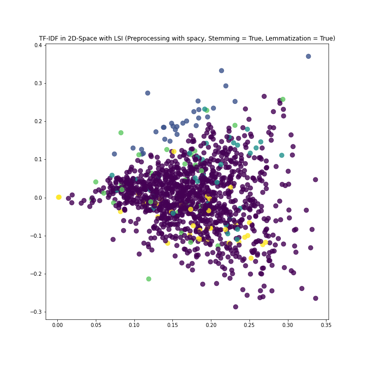

No clusters can be identified. Accordingly, the assigned clusters also make little sense and are distributed. 

When creating two clusters using LDA, the words representing a cluster seem to separate more from one-another.
```
Topic 0:
0.006*"assort" + 0.004*"optim" + 0.003*"model" + 0.003*"estim" + 0.003*"product" + 0.003*"network" + 0.003*"polici" + 0.003*"featur" + 0.003*"chang" + 0.003*"learn"

Topic 1:
0.004*"assort" + 0.002*"scikit" + 0.002*"python" + 0.002*"librari" + 0.001*"toolkit" + 0.001*"tslearn" + 0.001*"licens" + 0.001*"mahout" + 0.001*"surviv" + 0.001*"apach"
```
It can be clearly seen that topic 0 is defined by terms from the machine learning domain, while topic 1 can be clearly assigned to programming.

However, forming more than two clusters is a problem here as well. It can be seen that weights associated with the keywords are very small, or even 0.
```
Topic 0:
'0.001*"assort" + 0.000*"pycobra" + 0.000*"season" + 0.000*"qm" + 0.000*"tslearn" + 0.000*"dkrr" + 0.000*"cv" + 0.000*"successor" + 0.000*"mahout" + 0.000*"visualis"

Topic 1:
0.007*"assort" + 0.004*"optim" + 0.004*"model" + 0.004*"estim" + 0.003*"product" + 0.003*"network" + 0.003*"polici" + 0.003*"featur" + 0.003*"contextu" + 0.003*"chang"

Topic 2:
0.001*"assort" + 0.000*"cooper" + 0.000*"season" + 0.000*"exp3" + 0.000*"qm" + 0.000*"tslearn" + 0.000*"dkrr" + 0.000*"coop" + 0.000*"nonstochast" + 0.000*"cv"

Topic 3:
0.001*"assort" + 0.000*"season" + 0.000*"qm" + 0.000*"tslearn" + 0.000*"ehr" + 0.000*"dkrr" + 0.000*"cv" + 0.000*"hasmm" + 0.000*"successor" + 0.000*"mahout"

Topic 4:
0.001*"assort" + 0.001*"cubic" + 0.001*"svrc" + 0.000*"lite" + 0.000*"ahc" + 0.000*"ontolog" + 0.000*"snk" + 0.000*"season" + 0.000*"footnot" + 0.000*"qm"
```
Also, the words related to the topic do not seem to be very meaningful and do not help to understand what defines this topic.

The following figures show the LDA clustering with 2 and with 5 clusters in 2D space.
With two clusters, an almost linear line is created, which is divided into two parts by the clusters.
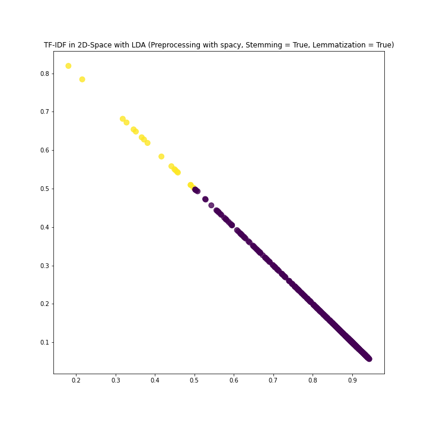


However, when attempting to extract five clusters, only two clusters were extracted. 
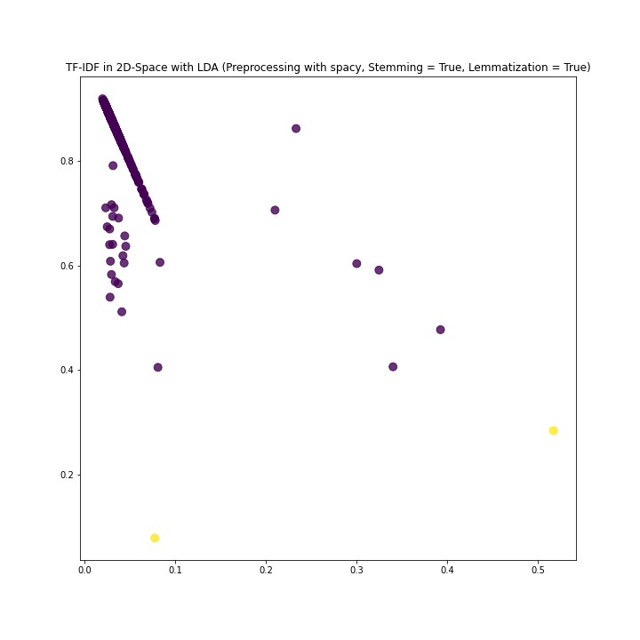

In the notebook in which the experiments were performed, a plot with pyLDAvis has also been created (https://github.com/DonatJR/ita_ws20/blob/main/notebooks/gensim_inspections.ipynb). In this plot it can also be seen that although theoretically five clusters should be extracted, practically only two exist.

If the abstracts are computed in 2D space using T-SNE it actually looks like five clusters should be able to be extracted.
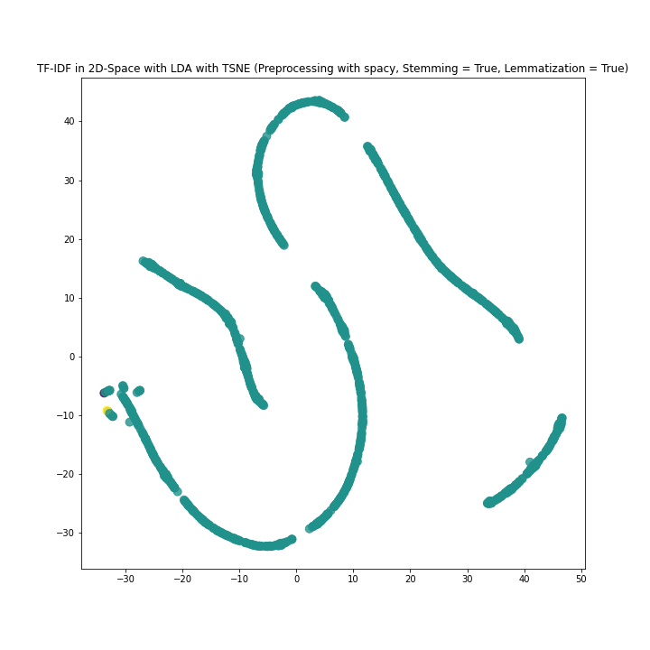
However, the output of T-SNE strongly depends on the parameters used. To interpret the results, more investigation into T-SNE and its parameters would be needed (https://distill.pub/2016/misread-tsne/).

## Data Analysis

### Data Sources
We mentioned three data sources for research papers in our project proposal:

- [jmlr](https://jmlr.csail.mit.edu) - an international forum for the electronic and paper publication of scholarly articles in all areas of machine learning

- [ann](http://aan.how) - a website maintained by Yale University's Learning and Information Group that provides a corpus consisting of over 400 scientific papers on NLP in plain text.

- [Crossref](https://crossref.org/) and their [API](https://api.crossref.org/) - an official Digital Object Identifer Registration Agency that provides access to the full text of its registered research papers through their own API.

We ended up using only the first source.

[ann](http://aan.how) proved an unreliable data source because: 

- we downloaded about 200 papers in txt format from [ann](http://aan.how) and randomly examined 10 of them: they all contained spelling/formatting mistakes, i.e. *Abstra-           ct* as a paragraph title
- the quality of the files made it hard to find regex for information extraction
- even though [ann](http://aan.how) has to each paper a html page where the abstract could be found, after examination, we were once again facing the problem of an error-ridden abstract

[Crossref](https://crossref.org/) provides a reliable way to access data, but filtering for specific topics and extracting URLs to PDFs as well as keywords is more difficult than initially assumed. For now, we don't intend to use `Crossref` as a data source. If we were to face problems with not having enough data in the future we can still fall back to using it.
 
[jmlr](https://jmlr.csail.mit.edu) proved an excellent data source because: 

- the research papers are ordered in volumes. There are currently 21 volumes available. Each volume has its own website, i.e. https://jmlr.csail.mit.edu/papers/v18/
- the volumes' URL differ only by the number of the volume
- to each research paper there are three links, two of them being:
   - a html page containing the abstract, names of the authors, title of the paper
   - the URL to the pdf
- almost all the PDFs have the same structure: 

Abstract

<abstract_text>

Keywords: <list_of_keywords>

- having a rigid structure allowed us to use regex to extract information

We decided to use the following information from a research paper: 
- title
- authors
- ref
- data source url
- pdf url
- keywords. 

Based on this, we scraped the html page of the research paper and converted the pdf into a txt file to extract the keywords using regex. The extracted information was saved in a json.
   
### Preprocessing
We do standard preprocessing before clustering. We tried out the three libraries: ```gensim```, ```spacy```
and ```nltk```. After dealing with some problems regarding lemmatization in ```gensim``` (and the depending
```pattern```, we found out in an [issue](https://github.com/RaRe-Technologies/gensim/issues/2716) on their official github repository,
that the library was not intended for preprocessing. We therefore dropped this one.
Our preprocessing consists of:
1. Removal non-alphabetic characters
2. Tokenization
3. Lemmatization
4. Stemming
5. Length normalization
6. Stop word removal
We use the respective standard models for the english language of the libraries.

The following figures show the top 10 words of the abstracts.
Without stemming or lemmatization, the top words include ```we```, ```the``` and ```in```. These words are unnecessary for clustering.

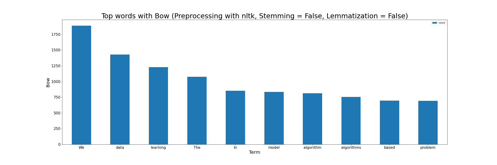

Preprocessing with stemming and lemmatization filters these terms among others.

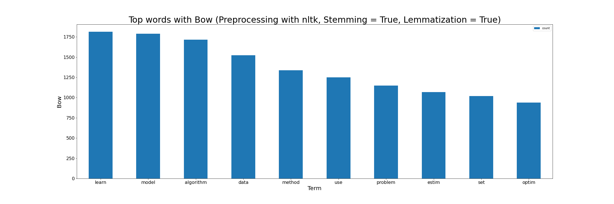

Weighting using tf-idf makes it more obvious that these are papers with a machine learning background.

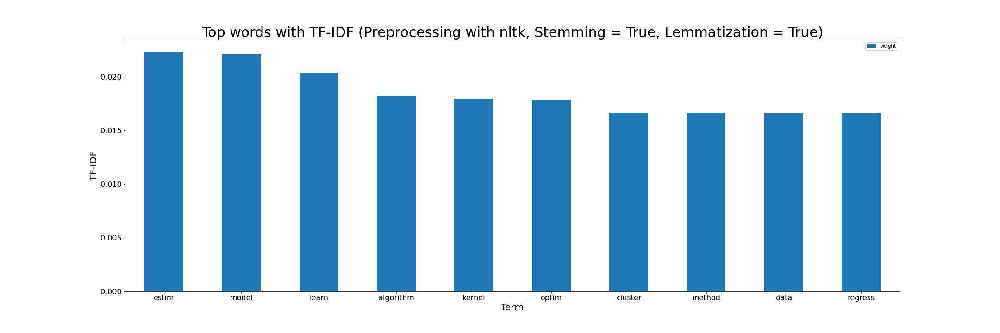

The choice of the library used for preprocessing only marginally affects the top words.

The pipeline is in part configurable, because we want to compare our results towards raw text inputs.
In order to take a quick look at our data after preprocessing, we plotted a word cloud of the tokens in the following figure:
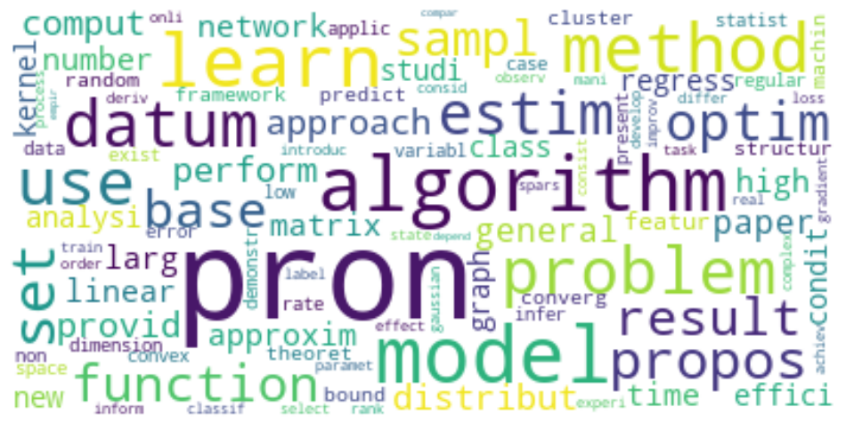
It can be seen, that our preprocessing does not remove very general words that probably apply to most papers.
We realized the following:
- Most papers share very common words for their common denominator field.
- Since we tried this out on machine learning papers, all tokenized abstracts include e.g."_data_", "model", etc. with a high frequency.
- It should be beneficial to include such common words and buzzwords in the stop word list

Currently our clustering performance will be suboptimal since we might not have very informative tokens for the respective topics.


### Basic Statistics
- No. of samples: 1261

#### Keywords Statistics:
- A keyword can contain multiple words, i.e, *bayesian statistics*.

- No of papers without keywords: 153
Reason: no keywords present in the papers

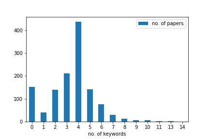

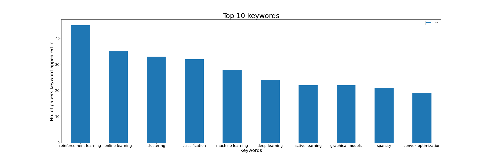

- 996 papers have no keywords in top 10

- 249 papers have 1 keyword in top 10

- 16 papers have 2 keywords in top 10

- The maximum no of top 10 keywords contained by a single papers is 2

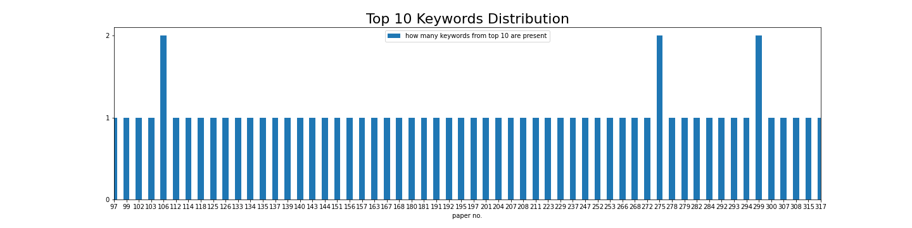

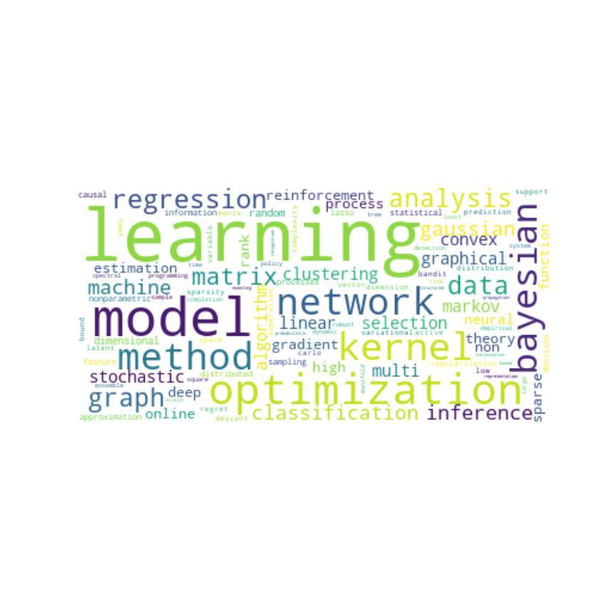

#### Abstract Statistics:
- No of papers without abstract: 36
Reason: we have two sources for the abstract:
 
i) a html page where the abstract is in a meta tag. This abstract contains inline math latex notation.
  
ii) the pdf where the abstract doesn't contain any latex notation

We extract them both (with the intention to later compare the quality), but only use the one from the html page in our data files.
  
After investigating why 36 papers seemingly have no abstract, it seems that for them the abstract is under a different html tag. We intend to correct this in the
scraping script, but we found the observation interesting, because it shows that scraping is very specific to the website we intend to extract information from.

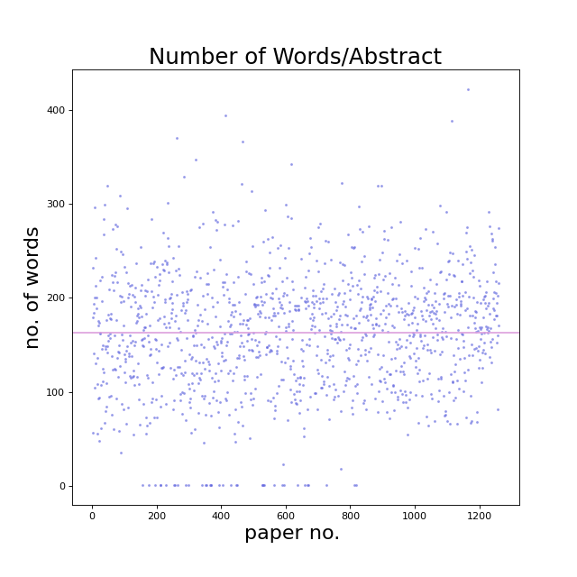

### Examples
 
      "title": "Online Sufficient Dimension Reduction Through Sliced Inverse Regression",
      "abstract": "Sliced inverse regression is an effective paradigm that achieves the goal of dimension reduction through replacing high dimensional covariates with a small number of linear combinations. It does not impose parametric assumptions on the dependence structure. More importantly, such a reduction of dimension is sufficient in that it does not cause loss of information. In this paper, we adapt the stationary sliced inverse regression to cope with the rapidly changing environments. We propose to implement sliced inverse regression in an online fashion. This online learner consists of two steps. In the first step we construct an online estimate for the kernel matrix; in the second step we propose two online algorithms, one is motivated by the perturbation method and the other is originated from the gradient descent optimization, to perform online singular value decomposition. The theoretical properties of this online learner are established. We demonstrate the numerical performance of this online learner through simulations and real world applications. All numerical studies confirm that this online learner performs as well as the batch learner.",
      "keywords": [
        "Dimension reduction",
        "online learning",
        "perturbation",
        "singular value decomposition",
        "sliced inverse regression",
        "gradient descent"
      ],
      "author": [
        "Zhanrui Cai",
        "Runze Li",
        "Liping Zhu"
      ],
      "ref": "https://jmlr.csail.mit.edu/papers/volume21/18-567/18-567.pdf",
      "datasource": "Journal of Machine Learning Research",
      "datasource_url": "https://jmlr.csail.mit.edu/"
    

#### Data - Reflection
While doing the first assignment we kept asking ourselves why: why should we spend so much time looking for a conversion library or come up with regex expressions.
We take it all back: *now* we understand why. By working with regex in the first assignment, it seemed natural to use this newly acquired knowledge for information extraction. Furthermore, after having tested out so many conversion libraries, we already knew which ones we could trust.

Thanks to the 2nd assignment, we could reuse our code for the wordcloud of keywords and the top 10 keywords plot.
