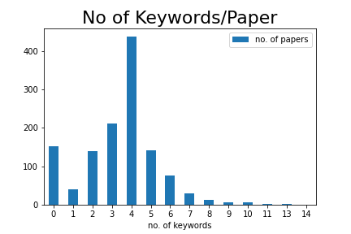

# Project Title:

## General

### Team members

* Daniela Fichiu
  * 3552717
  * BSc Applied Computer Science & BSc Mathematics
  * daniela.fichiu@stud.uni-heidelberg.de

* Christian Homeyer
  * 3606476
  * PhD Computer Science
  * ox182@uni-heidelberg.de

* Jessica Kaechele
  * 3588787
  * MSc Applied Computer Science
  * uo251@stud.uni-heidelberg.de

* Jonas Reinwald
  * 3600238
  * MSc Applied Computer Science
  * am248@stud.uni-Heidelberg.de


### Existing Code Fragments
In case you are choosing a project for which there exists code that you are using, you must clearly indicate those parts of your project and link to them.
TODO: we are not using any existing code, right? --> replace with "No existing code fragments used." 

### Utilized libraries
TODO: Provide a list of all required libraries to successfully run your system. Ideally, this comes in the __form of a separate requirements.txt file__.

### Contributions
We had some issues with non-matching email addresses in commits. This results in some team members not showing up as project contributors (or with reduced contributions), as their GitHub profile cannot be linked to the git user used to make the commits. The commit history nevertheless reflects all contributions correctly, just without a direct link to the respective GitHub profile.

## Project State

### Planning State
TODO: brief overview of everything we have done until now

### Future Planing
TODO: brief timeline of tasks to be done in second phase of project

### High-level Architecture Description
TODO: high level description of _project structure_ and _pipeline_.

### Experiments
TODO: In case that you already have some results from initial experiments, you may detail the results and implications. We strongly encourage you to already provide simple baselines.

## Data Analysis

### Data Sources
TODO: Daniela 
jmlr - reason for choice + process of extracting the data; mention scraping script
ann - why it wasn't used

### Preprocessing
TODO: Detail any preprocessing steps you have taken to ensure proper data quality. This can include unicode normalization, length normalization, text sanitizing, etc

We do standard preprocessing before clustering. We tried out the three libarries: ```gensim```, ```spacy``` 
and ```nltk```. After dealing with some problems regarding lemmatization in ```gensim``` (and the depending 
```pattern```, we found out in an issue on their official github repository, 
that the library was not intended for preprocessing. We therefore dropped this one.  
Our preprocessing consists of:
1. Removal non-alphabetic characters
2. Tokenization
3. Lemmatization
4. Stemming
5. Removal too short/long words.
6. Stop word removal
We use the respective standard models for the english language of the libaries.

The pipeline is in part configurable, because we want to compare our results towards raw text inputs. 
After taking a first look at the resulting token for our example data, we realized the following:
- Most papers share very common words for their common denominator field. Since we tried this out on 
machine learning papers, all tokenized abstracts include e.g. _data_ with a high frequency.
We believe that it might be benificial to include words like these and buzzwords in the stop word list, since they give no informative characterization of the paper topics.

### Basic Statistics
TODO: Daniela - expand on the observations

No of samples: 1261

996 papers - no keywords in top 10 (a keyword can contain multiple "words")

249 papers - 1 keyword in top 10

16 papers - 2 top 10 keywords (max/paper)

No of papers without keywords: 153

 Reason: no keywords present in the papers
 
No of papers without abstract: 

 Reason: we have to sources for the abstract: 
 
  i) a html page where the abstract is in a meta tag
  
  ii) the pdf, could be extracted using regex (cumbersome)
  
 After checking, it seems that for 36/1261 papers the abstract is under a different h3 tag




### Examples
TODO: Daniela - paste an example 
