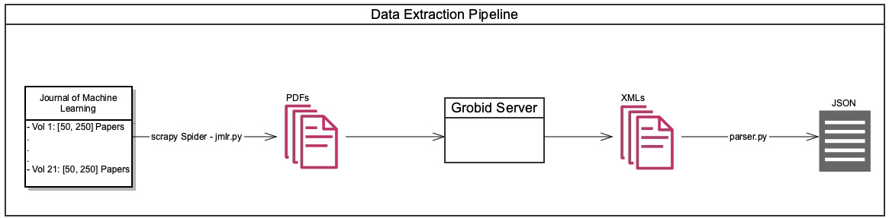
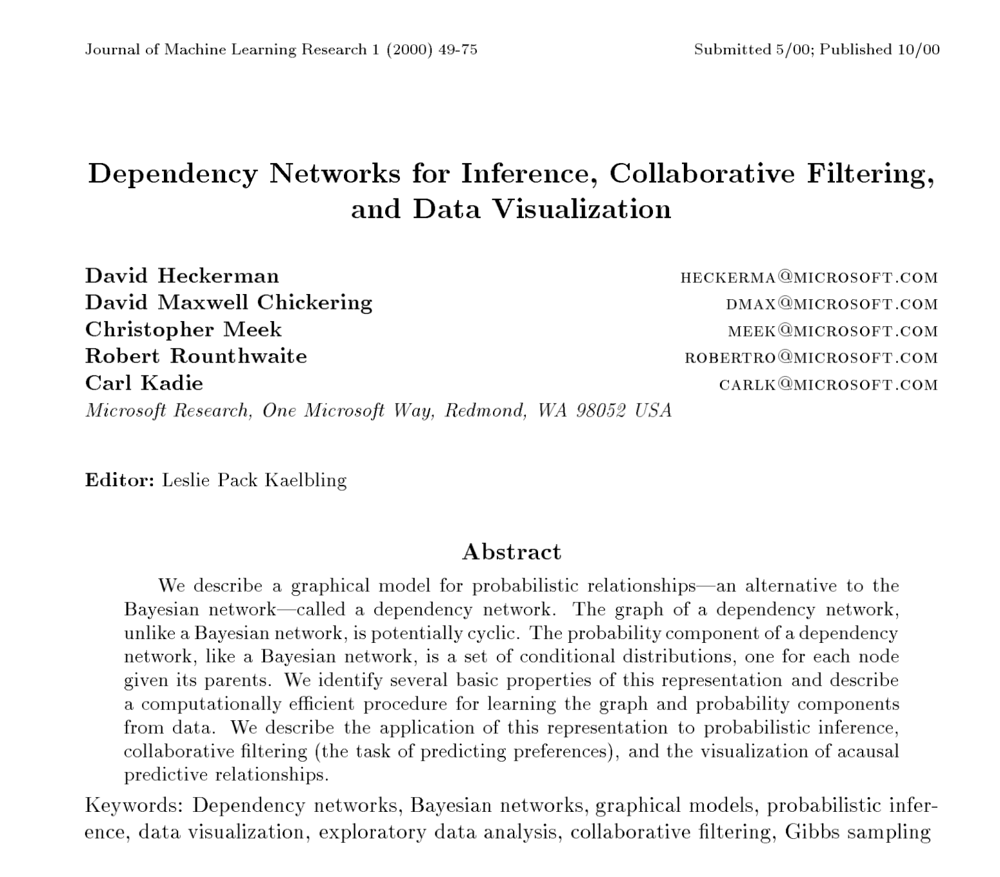
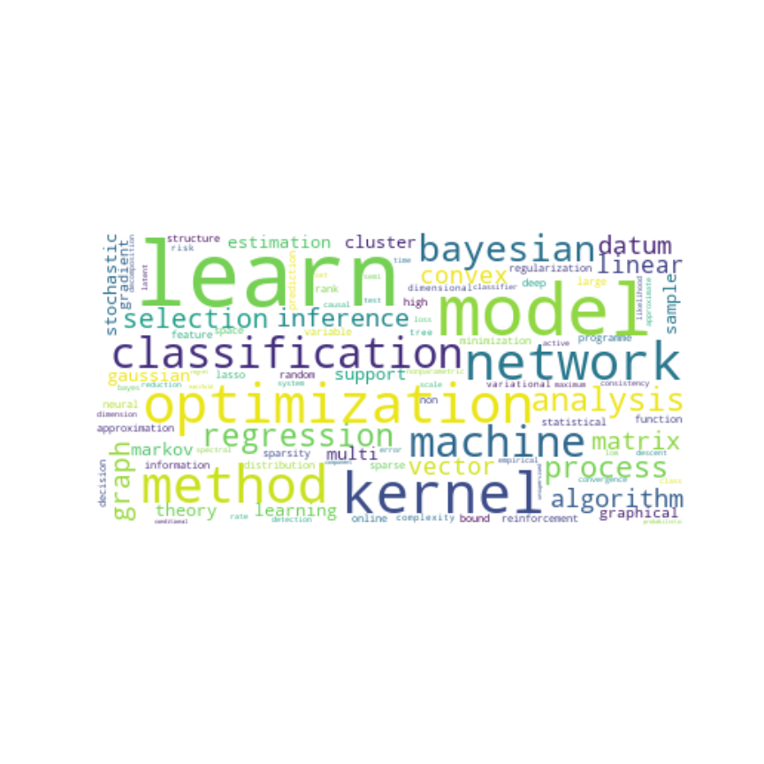
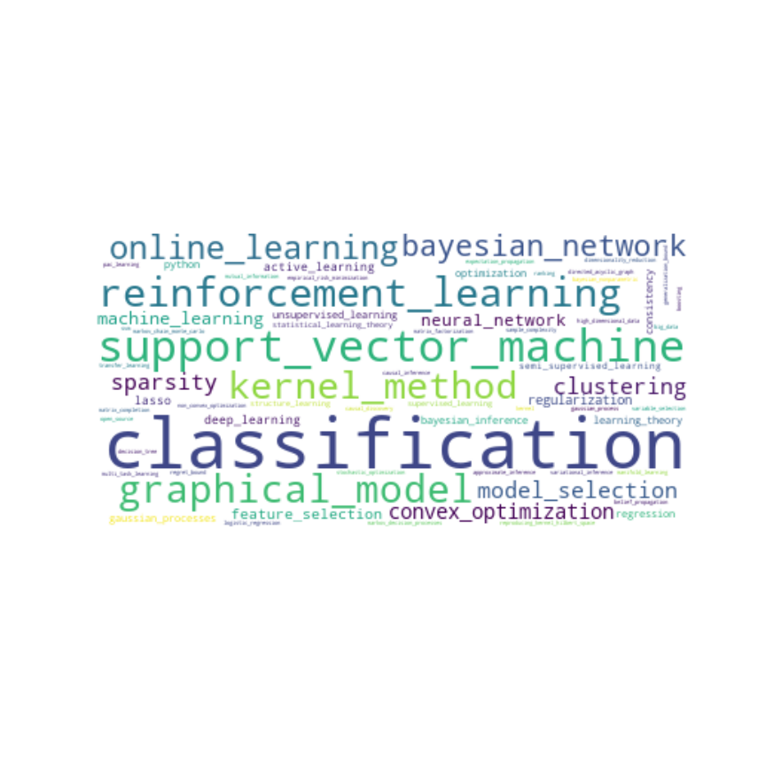

## Data

**SLIDES**

NOT SLIDES

[UNIMPORTANT]

- **Information from a research paper we were interested in:**
    - **Keywords → Evalution**
    - **Abstract → Cluster**
    - **Title**
    - **Authors**
    - **Ref**

### General Statistics Data Source

- **Journal of Machine Learning: peer-reviewed open access scientific journal covering machine learning** 
- **Papers organized in 21 (currently 22) volumes** - **between 60 and 250 papers/volume** ⇒ easy to scrape as almost all pdfs are found under two html tags

# Pipeline

- **Initial Solution: scrape with own scraping script (requests) and then extract information using Regex → Problem: Find one regex to suit them all**
- **Solution: Grobid - machine learning software for extracting information from scholarly documents**
- \[Problem: Ref is not included in the pdf ⇒ Solution save the file with their ref as their name]
- \[Problem: Spider interprets the "/" in ref as folder locations ⇒ Solution: change "/" into ";"]

### General Statistics Dataset:

- **2230 Research Papers**
- **20 without an abstract**
- **159 without no keywords**
- **Average no. of keywords per research paper is 4.7040358744394615**

- Words Wordcloud

- Keywords Wordcloud

## Evaluation

### Overview

- **Idea: Abstract can contain nonrelevant information; Keywords are distilled truth: describe the paper content's in the least number of words ⇒ use keywords to find the ground truth**
- **Idea: Cluster using keywords**

### Process

- **Split the Keywords into words and preprocess** (lemmatization, stop words removal, lowercase, bigrams & unigrams removal) them:
- **Example: learning to rank, Bayesian inference, neural networks → learn, rank, bayesian, inference, neural, network** (I would personally add it to the slides, but it's your choice :) )
- **Create bow corpus** \[and compute cosine similarity between papers]
- \[Manually check the similarities for different thresholds]
- **Compute cosine distance and use precomputed distance matrix to cluster using dbscan (density based, doesn't need predefined amount of clusters)**
- **Try different thresholds for eps, choose 0.3 and manually check clustering results**
- \[Check dbscan results with kmean (n_clusters the results obtained after clustering with dbscan)\]
